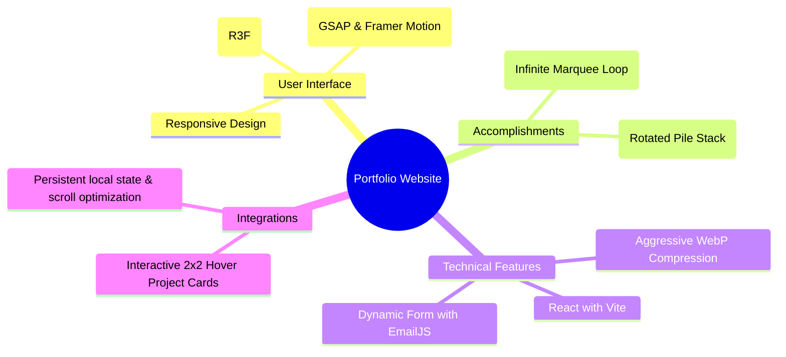

<div align="center">


<p align="center">
  <a href="#features">Features</a> •
  <a href="#projects">Projects</a> •
  <a href="#installation">Installation</a> •
  <a href="#tech-stack">Tech Stack</a>
</p>

[](https://github.com/Purjeet979/Portfolio)
[](https://reactjs.org)

<p align="center">A high-performance, responsive 3D developer portfolio website showcasing professional experience, projects, and accomplishments. Built with React, Vite, Three.js, GSAP, and Framer Motion. ✨</p>

</div>

## ✨ Features

<div align="center">



</div>

## 🚀 Key Highlights

* **3D Interactive Graphics:** Dynamic desktop PC and rotating Earth 3D models utilizing `@react-three/fiber` and `@react-three/drei` with high-performance execution settings.
* **Dual Certificates & Achievements Section:**
  * **Certificates:** Stacking cards layout with rotation effects that expands to a full chronological timeline.
  * **Achievements:** An infinite auto-scrolling marquee bar showing hackathon positions and internships.
* **2x2 Grid Hover Splitting:** Project cards display main covers and transform into a 4-quadrant interactive screenshot grid on hover.
* **Aggressive Bundle Size Reduction:** All assets optimized and converted to `.webp` format, lowering total bundle assets from **~15MB** to under **1.8MB**.

## 🛠️ Installation & Setup

1️⃣ **Clone the repository:**

```bash
git clone https://github.com/Purjeet979/Portfolio.git
```

2️⃣ **Navigate to the directory:**

```bash
cd Portfolio
```

3️⃣ **Install dependencies:**

```bash
npm install
```

4️⃣ **Run local development server:**

```bash
npm run dev
```

5️⃣ **Build production bundle:**

```bash
npm run build
```

## 💻 Tech Stack

<table align="center">
  <tr>
    <td align="center" width="96">
      
      <br>React
    </td>
    <td align="center" width="96">
      
      <br>Vite
    </td>
    <td align="center" width="96">
      
      <br>Tailwind
    </td>
    <td align="center" width="96">
      
      <br>Three.js
    </td>
    <td align="center" width="96">
      
      <br>Python
    </td>
    <td align="center" width="96">
      
      <br>Java
    </td>
  </tr>
</table>

## 📁 Key Projects

1. **PrepGuru (Full Stack Java):** AI-powered learning platform using Spring Boot and React.
2. **SecurityApp:** High-security biometric credential vault utilizing AES-256 encryption.
3. **ShramSetu:** Decentralized livelihood marketplace connecting daily-wage workers directly with employers.
4. **Personal AI Assistant:** Voice/text agent using NLP and OpenAI GPT-4 API engine.
5. **SnehaSathi:** Personal safety mobile application built with Flutter, Dart, and Firebase.
6. **T-Rex Runner Game:** Canvas-based 2D infinite runner game in Vanilla JavaScript.

## 📄 License

<div align="center">

MIT License © [Purjeet Shahu](LICENSE)


</div>
